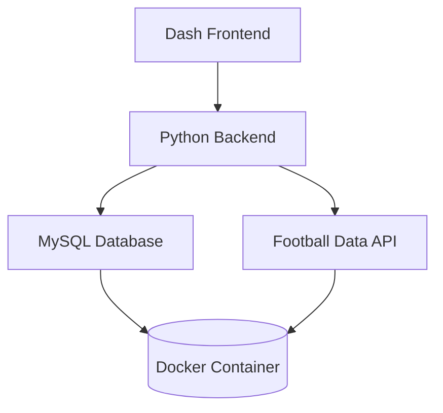

# ProyectofinalBD
Proyecto final de bases de datos III
Football Analytics Dashboard 
## Descripción 
Este dashboard interactivo permite visualizar y analizar estadísticas de partidos de fútbol, incluyendo:

Comparación de rendimiento entre equipos

Distribución de resultados (victorias locales/visitantes/empates)

Grafos de relaciones entre equipos

Tendencias temporales de rendimiento

## Características principales 
Visualización interactiva con filtros por fecha, competición y equipos

KPIs clave: porcentaje de victorias, posesión promedio, goles por partido

Grafos dirigidos que muestran relaciones entre equipos

Datos en tiempo real conectados a Football Data API

Arquitectura escalable con Docker y MySQL
## Arquitectura del Proyecto


## Requisitos del sistema 
Docker 20.10+

Docker Compose 1.29+

2 GB de RAM disponibles

Conexión a internet para acceder a la API
Instalación y configuración ⚙️
Clona el repositorio:
```bash
git clone https://github.com/tu-usuario/football-analytics.git
cd football-analytics
```
Crea el archivo .env:
```bash
cp .env.example .env
```
Edita el archivo .env con tus credenciales:
```ini
DB_USER=futbol_user
DB_PASSWORD=futbol_pass
API_KEY=tu_api_key_de_football_data
```
Inicia los servicios:
```bash
docker-compose up -d --build
```
Uso 
Accede al dashboard en tu navegador:
```text
http://localhost:5001
```
Estructura del proyecto 
```text
football-analytics/
├── app/                      # Código principal de la aplicación
│   ├── main.py               # Aplicación Dash
│   ├── database.py           # Conexión a la base de datos
│   └── utils/                # Utilidades varias
├── docker-compose.yml        # Configuración de Docker
├── Dockerfile                # Configuración del contenedor
├── requirements.txt          # Dependencias de Python
└── sql/                      # Scripts SQL
    └── init.sql              # Inicialización de la base de datos
```
