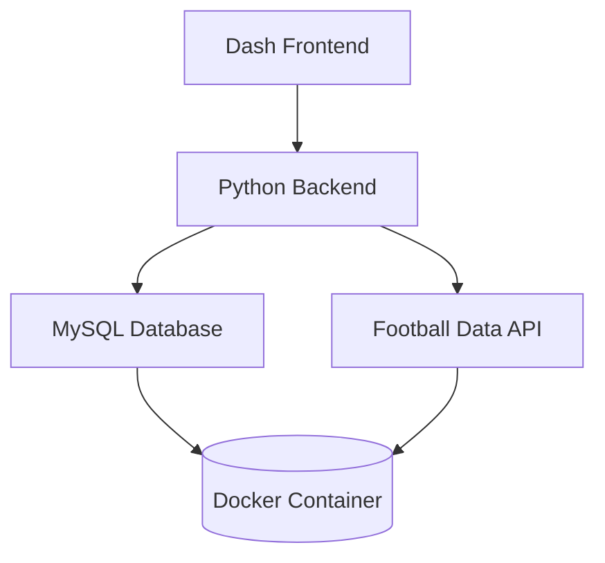

# ProyectofinalBD
Proyecto final de bases de datos III
Football Analytics Dashboard 
## Descripción 
Este dashboard interactivo permite visualizar y analizar estadísticas de partidos de fútbol, incluyendo:

Comparación de rendimiento entre equipos

Distribución de resultados (victorias locales/visitantes/empates)

Grafos de relaciones entre equipos

Tendencias temporales de rendimiento

## Características principales ✨
Visualización interactiva con filtros por fecha, competición y equipos

KPIs clave: porcentaje de victorias, posesión promedio, goles por partido

Grafos dirigidos que muestran relaciones entre equipos

Datos en tiempo real conectados a Football Data API

Arquitectura escalable con Docker y MySQL
## Arquitectura del Proyecto

## Requisitos del sistema 
Docker 20.10+

Docker Compose 1.29+

2 GB de RAM disponibles

Conexión a internet para acceder a la API
